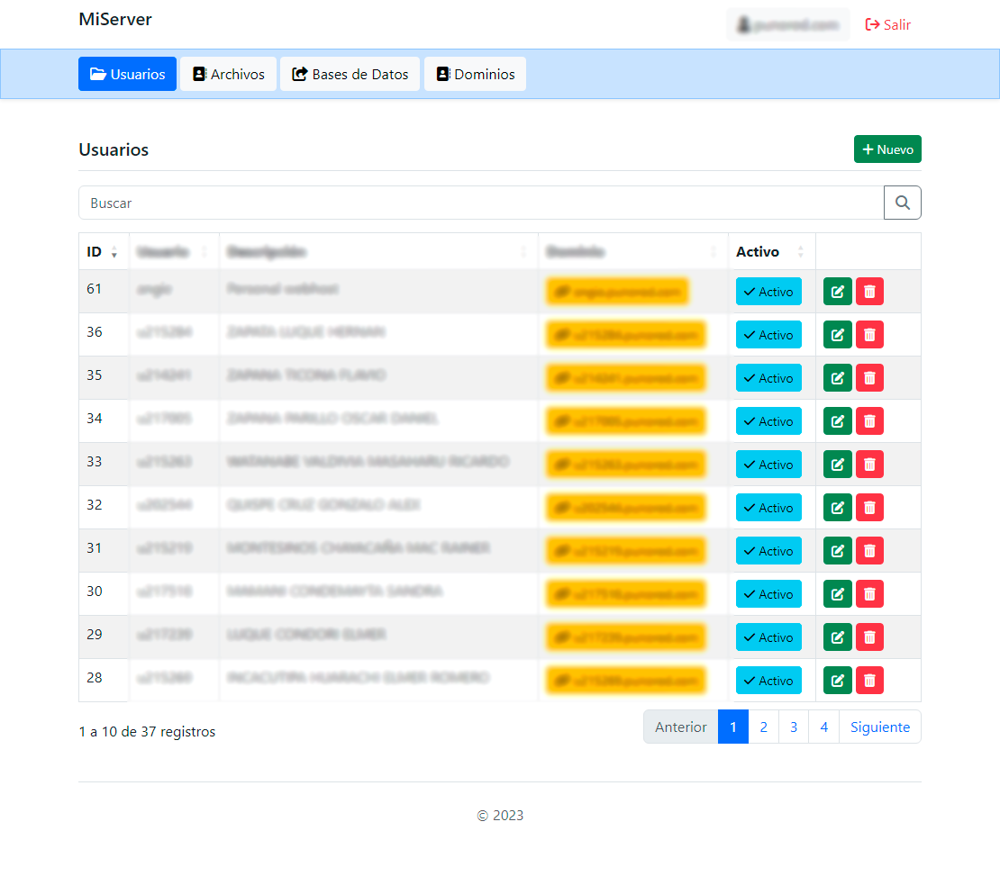
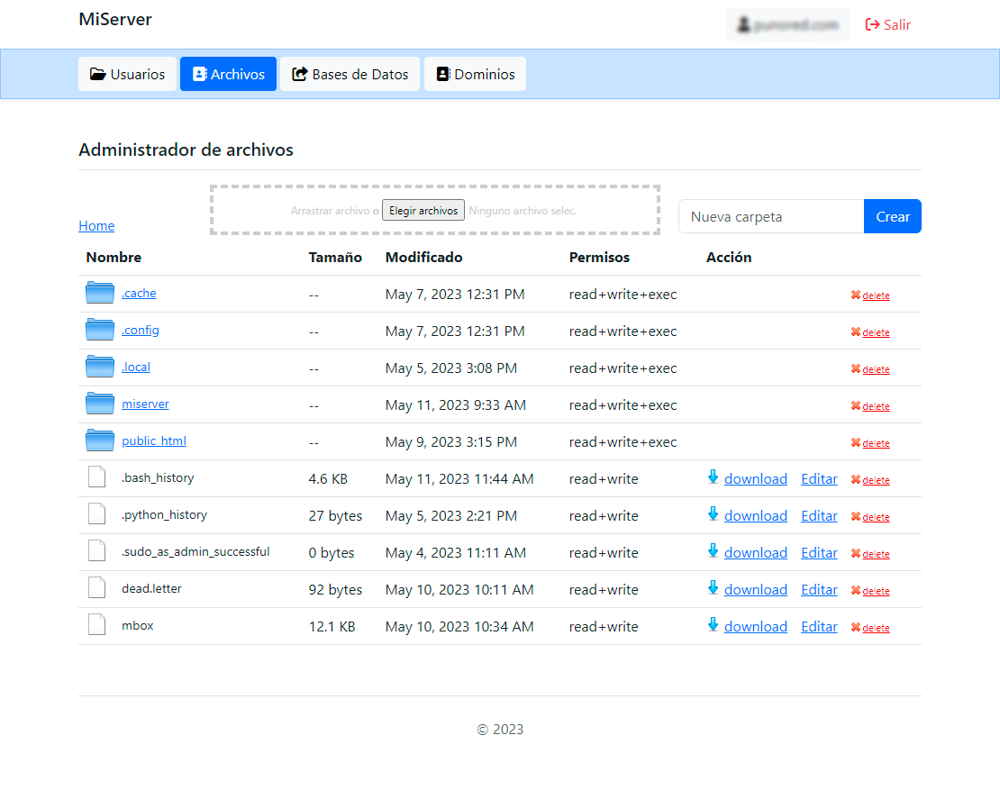
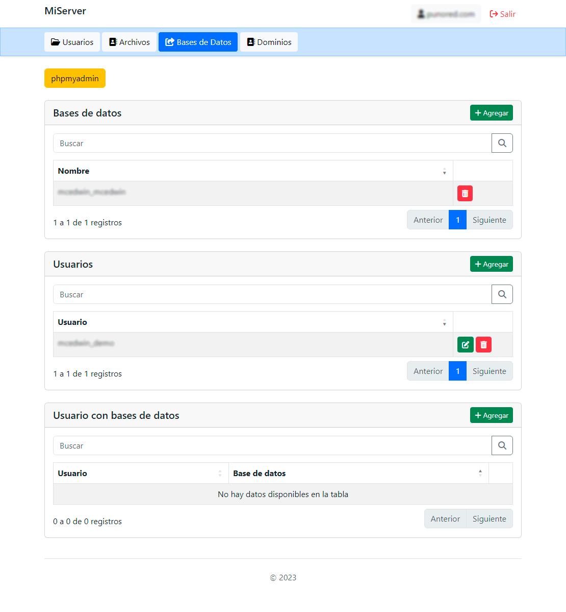
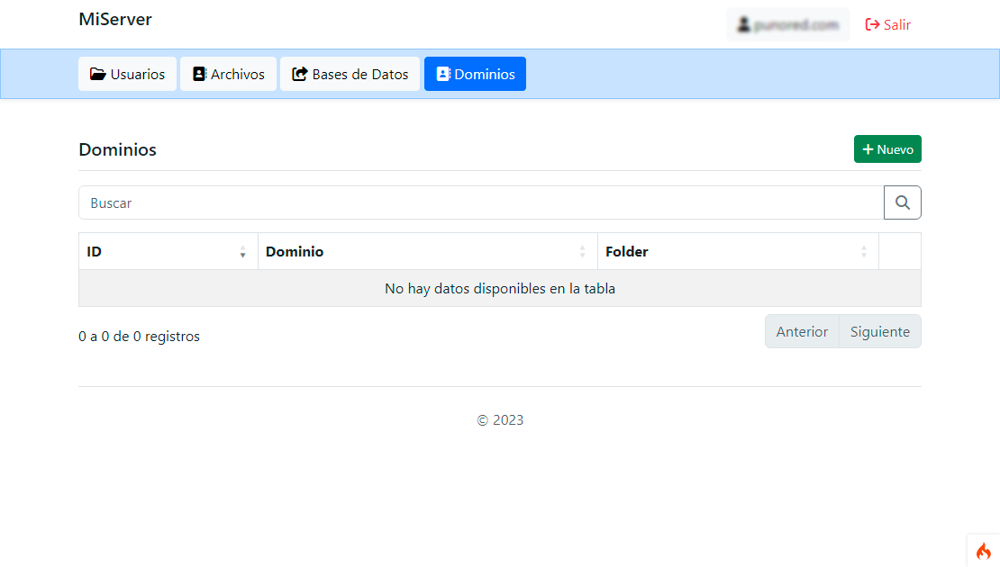

An alternative to CPANEL, to manage a single instance or a droplet.
# Domain
add domain
A punored.com IP

add sudomain wildcard
CNAME  *.punored.com IP

# install server in ubuntu
apt update
apt install apache2
apt install mysql-server
apt install php libapache2-mod-php php-mysql
apt-get install -y php8.3-cli php8.3-common php8.3-mysql php8.3-zip php8.3-gd php8.3-mbstring php8.3-curl php8.3-xml php8.3-bcmath php8.3-intl

# install composer

sudo apt-get install curl unzip
sudo apt-get install php php-curl
curl -sS https://getcomposer.org/installer -o composer-setup.php
php composer-setup.php --install-dir=/usr/local/bin --filename=composer
composer self-update 

# server
git clone https://github.com/mcedwin/miserver.git
cd miserver/core
composer install
cd server
php -S 0.0.0.0:8004

# install cerbot
sudo apt install certbot python3-certbot-apache

# serstar services
apachectl restart
service ssh restart
systemctl restart mysql

# MYSQL
Configurar bind 0.0.0.0
sudo nano /etc/mysql/mysql.conf.d/mysqld.cnf

# PHP display_errors = on
sudo nano /etc/php/8.3/apache2/php.ini

# PasswordAuthentication yes, for ppk login
sudo nano /etc/ssh/sshd_config

# Reset all
sudo apachectl restart
sudo service ssh restart
sudo systemctl restart mysql

# For deny user home directory (try)
https://unix.stackexchange.com/questions/85537/how-to-hide-someone-elses-directories-from-a-user

# refresy certs
sudo certbot --apache
